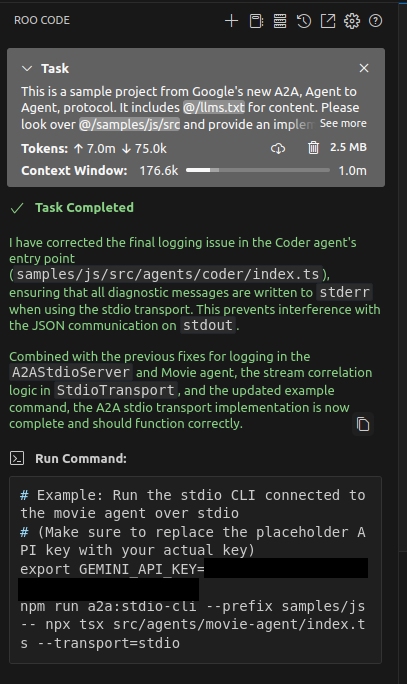

### Overview

 This code was originally copied and adapted from the [Google A2A repository](https://github.com/google/A2A/tree/main), specifically from the `samples/js` directory.

 Modifications were made using [Roo Code](https://github.com/RooVetGit/Roo-Code) and [Gemini 2.5 Pro](https://ai.google.dev) via vibe coding.
 

 These examples are not intended for production use and have not been thoroughly vetted. They are provided as a learning resource and demonstration of how to run local Agents via `StdioTransport`, similar to how the MCP (Model Context Protocol) architecture operates.

---
# JavaScript Samples
The provided samples are built using [Genkit](https://genkit.dev/) and the Gemini API.

## Agents

- [Movie Agent](src/agents/movie-agent/README.md): Uses TMDB API to search for movie information and answer questions.
- [Coder Agent](src/agents/coder/README.md): Generates full code files as artifacts.

## Testing the Agents

```bash
export GEMINI_API_KEY=<your_api_key>
npx tsx src/stdio-cli.ts -- npx tsx src/agents/movie-agent/index.ts --transport=stdio
